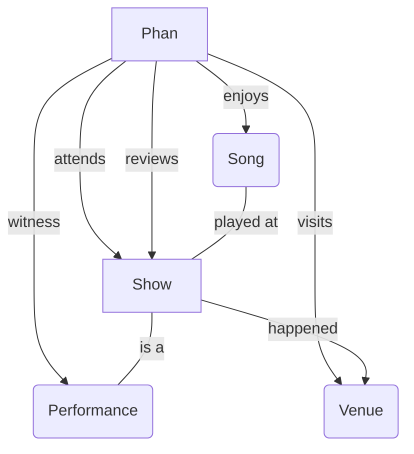

# Mixpanel Phish
a Mixpanel project to track the greatest rock band of our time (and their fans)

actual docs todo... but we're trying to model something like this:

in mixpanel's ERD: https://docs.mixpanel.com/docs/data-structure/concepts